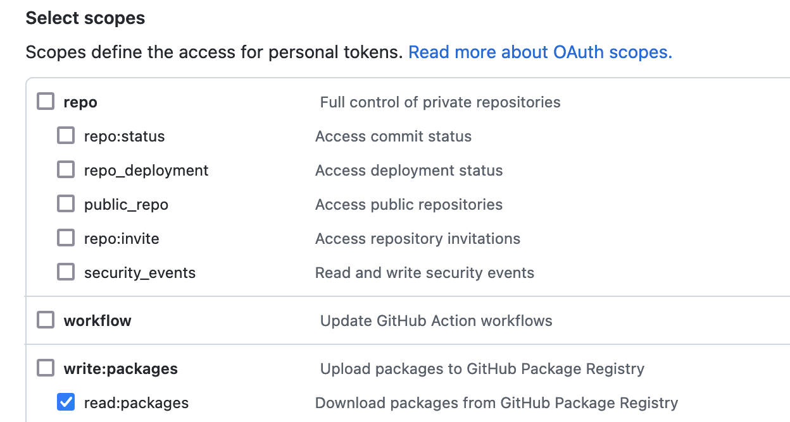

How to use the github maven repository
---

1. Add the repositroy to your `~/.m2/settings.xml`

````
<settings>
    <servers>
        <server>
            <id>github-searchgears-oev</id>
            <username>token</username>
            <password>${gh_token}</password>
        </server>
    </servers>
</settings>
````

2. Add the repository and dependency to your `pom.xml`

````
  <repositories>
    <repository>
      <id>github-searchgears-oev</id>
      <name>GitHub searchgears Apache Maven Packages</name>
      <url>https://maven.pkg.github.com/searchgears/customers-oev</url>
    </repository>
  </repositories>

  <dependencies>
    <dependency>
      <groupId>com.neomo</groupId>
      <artifactId>neomo-federated-search</artifactId>
      <version>1.0-SNAPSHOT</version>
    </dependency>
  </dependencies>
````

3. Generate a github token with read packages permissions

Go to https://github.com/settings/tokens and create and create a token with `read:packages` permission. Don't forget to copy your token since it will be visible only once!



4. Run your build with the supplied token

`mvn compile -Dgh_token=<your token value>`


